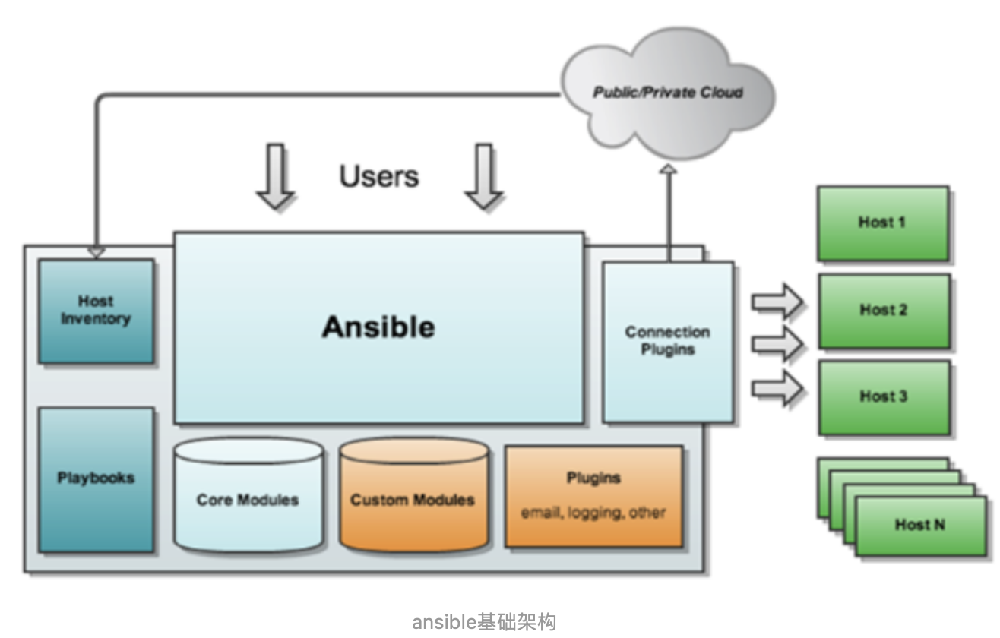

# Ansible基础

## 介绍		

ansible是自动化运维工具，基于python开发，实现批量系统配置、批量程序部署、批量运行命令等功能，默认通过ssh协议管理机器。

​		ansible被定义为配置管理工具，配置管理工具通常具有以下功能：

		- 确保所依赖的软件包已经被安装
		- 配置文件包含正确的内容和正确的权限
		- 相关服务被正确运行

### 1.1  ansible基本架构

​		ansible系统由控制主机和被管理主机组成,控制主机不支持windows平台



​	

- 核心：ansible
- Core Module： ansible自带的模块
- Custom Modules：核心模块功能不足时，用户可以添加扩展模块
- Plugins：通过插件来实现记录日志，发送邮件或其他功能
- Playbooks：剧本，YAML格式文件，多个任务定义在一个文件中，定义主机需要带哦用哪些模块来完成的功能
- Connection Plugin：ansible基于连接插件连接到各个主机上，默认使用ssh
- Host Inventory：记录由Ansible管理的主机信息，包括端口、密码、ip等

### 1.2  ansible程序目录结构

- 配置文件：/etc/ansible/
- 执行文件目录：/usr/bin/
- lib依赖库：/usr/lib/python3.7/site-packages/ansible/
- help文件：/usr/lib/python3.7/site-packages/ansible

## 2 ansible任务执行

### 2.1 ansible任务执行模式

- ad-hoc模式（点对点模块）

​       使用单个模块，支持批量执行单条命令，相当于在bash中执行一句shell命令

- playbook模式（剧本模式）

  ansible主要的管理方式，通过多个task的集合完成一类功能，可以理解为多个ad-hoc的配置文件

### 2.2 ansible执行流程

- 1. ansible执行流程
  2. 读取ansible.cfg文件
  3. 通过规则过滤inventory中定义的主机列表
  4. 加载task对应的模块文件
  5. 通过ansible core将模块或命令打包成python脚本文件
  6. 将临时脚本文件传输至远程服务器
  7. 对应执行用户的家目录的'.ansible/tmp/xxx/xxx.py'文件
  8. 给文件加执行权限
  9. 执行py文件并返回结果
  10. 删除临时文件并退出

## 3 ansible安装与初探

### 3.1 conda安装

首先，创建ansible环境：

```
conda create --name ansible python=3.7
```

进入环境：

```
conda activate ansible
```

安装ansible：

```
conda install -c conda-forge ansible
```

### 3.2 连接远程主机

将本机ssh复制到远程主机

```
ssh-copy-id root@xxx.xxx.xxx.xxx
```

保存远程主机ip到当前主机的know_hosts

```
ssh-keyscan xxx.xxx.xxx.xxx >> ~/.ssh/known_hosts
```

本机创建管理远程主机的配置文件/etc/ansible/hosts。并配置如下信息

```
[test]
xxx.xxx.xxx.xxx ansible_user=root
```

验证配置，查看是否能ping通：

```
#as root
ansible all -m ping -u root

#as root, sudoing to root
ansible all -m ping -u root --sudo

#as root sudoing to zaq
ansible all -m ping -u root --sudo --sudo-user batman 
```

成功后出现xxx.xxx.xxx.xxx | SUCCESS，则成功

否则，使用命令：

```
ansible all -m ping -vvv
```

来查看错误信息

## 4 Inventory文件

​		ansible的主要功用在于批量主机操作，为了便捷地使用其中的部分主机，可以在inventory file中将其分组命名。

​		默认的inventory file为/etc/ansible/hosts。除了默认文件外，还可以同时使用多个inventory文件，也可以从动态源，或云上拉取inventory配置信息。

​		/etc/ansible/hosts文件的格式：

```
mail.example.com

[webservers]
foo.example.com
bar.example.com

[dbservers]
one.example.com
two.example.com
three.example.com
```

## 5 Patterns

​		在Ansible中，Patterns是指我们怎样确定由哪一台主机来管理，意思就是与哪台主机进行交互，但是在:doc:playbooks中它指的是对应主机应用特定的配置或执行特定进程。

​		确认哪台机器将被执行：

```
ansible <pattern_goes_here> -m <module_name> -a <arguments>
```

​		例：

```
ansible webservers -m service -a "name=httpd state=restarted"
```

### 6 PlayBook

​		playbook基础组件：

- Hosts：运行执行任务（task）的目标主机
- remote_user：在远程主机上执行任务的用户
- tasks：任务列表
- handlers：任务，与tasks不同的是只有在接收到通知时才会被触发
- templates：使用模版语言的文本文件，使用jinja2语法
- variables：变量，变量替换{{ variable_name }}

​		测试playbook

```
ansible-playbook --check xxxx.yaml
```

​		运行playbook

```
ansible-playbook xxxx.yaml
```

