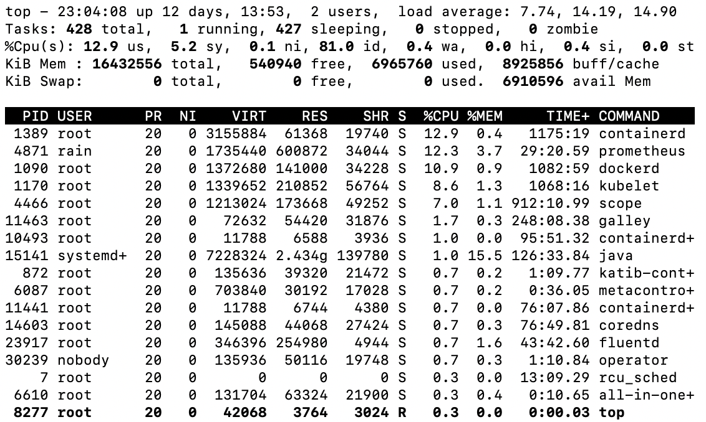
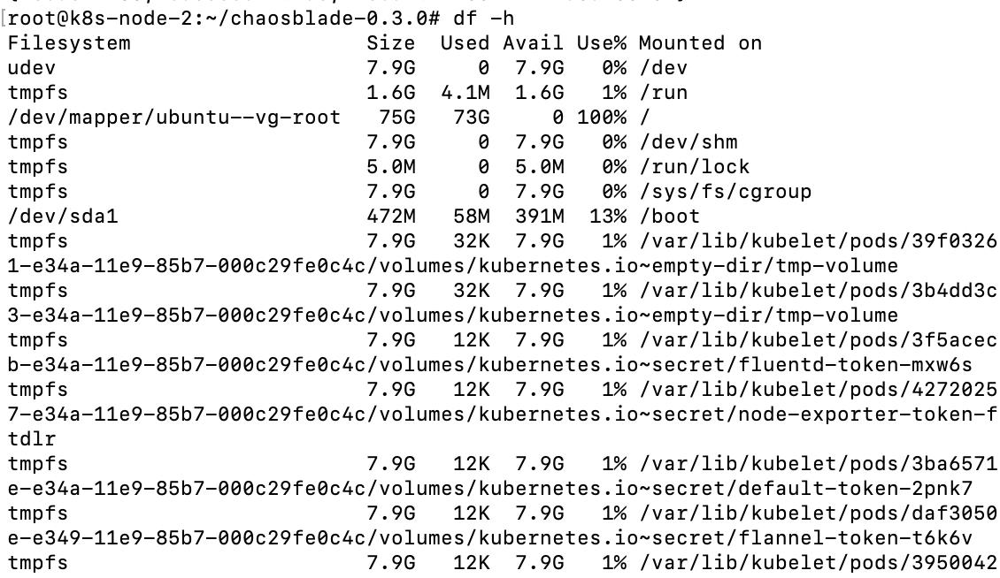
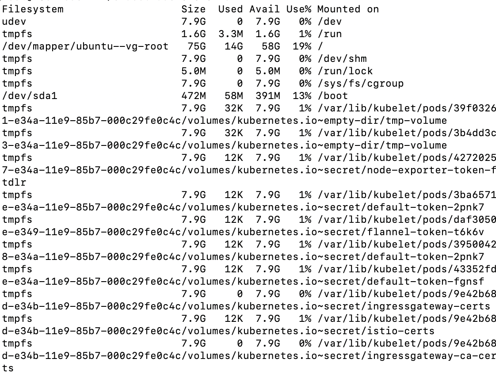
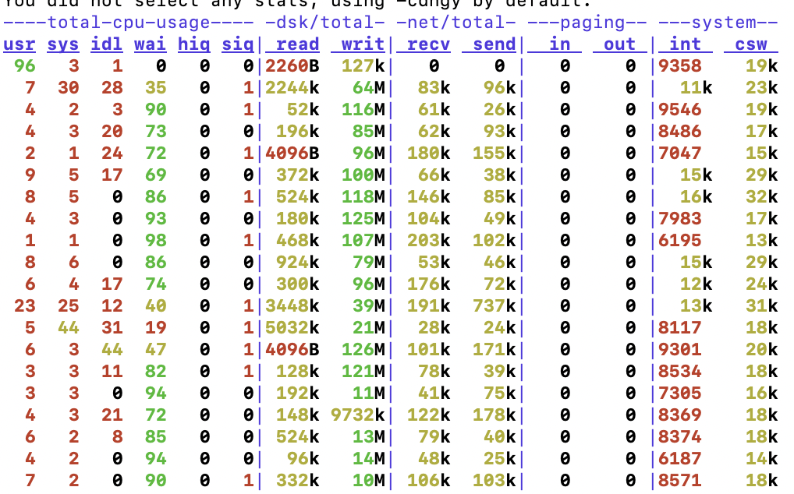
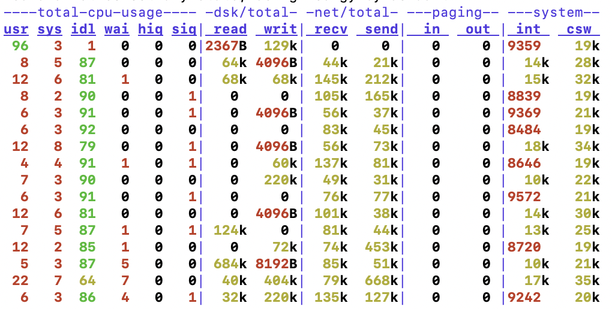
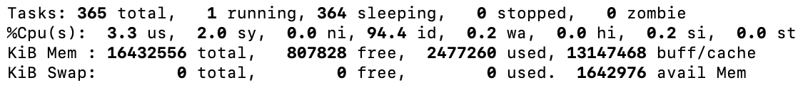
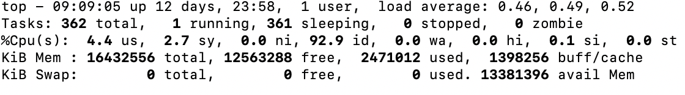

# Chaosblade 

### 1. Chaosblade的简介

​	Chaosbalde是一个故障模拟工具，用于模拟常见的故障场景，帮助提升分布式系统的可恢复性和对故障的容错性，可实现底层故障的注入，特定是操作简洁、无侵入 、扩展性强。

​	其目前支持的演练场景有操作系统类的CPU、磁盘、进程、网络、Java应用类的Dubbo、MySQL、Servlet和自定义类方法延迟或抛异常等以及杀容器、杀Pod。

​	本文档模拟Chaosblade的两个使用场景：

- 模拟服务器磁盘爆满
- 模拟服务器内存不足

### 2. Chaosblade的基本使用

#### 2.1 下载安装包

https://github.com/chaosblade-io/chaosblade/releases

#### 2.2 安装

```
# tar zxvf chaosblade-0.2.0.linux-amd64.tar.gz -C /Data/apps/
# mv /Data/apps/chaosblade-0.2.0 /Data/apps/chaosblade
```

#### 2.3 基本命令

```
./blade help

Available Commands:
  create      Create a chaos engineering experiment
  destroy     Destroy a chaos experiment
  help        Help about any command
  prepare     Prepare to experiment
  query       Query the parameter values required for chaos experiments
  revoke      Undo chaos engineering experiment preparation
  server      Server mode starts, exposes web services
  status      Query preparation stage or experiment status
  version     Print version info

Flags:
  -d, --debug   Set client to DEBUG mode
  -h, --help    help for blade
```

### 3. cpu

##### 3.1 cpu满载

```
./blade create cpu fullload
```

使用top命令查看cpu使用情况：

如果忘记了uid，使用命令：

```
./blade status --type create
```

恢复故障：

```
./blade destroy uid
```



可以看到，状态恢复原状。

### 4. disk

##### 4.1 磁盘不足

故障注入 ：

填充大小为200G文件:

```
./blade create disk fill --size 20480
```

查看当前fileSystem的状态：

```
df -h
```



故障恢复：

```
./blade destroy uid
```



##### 4.2磁盘IO高

故障注入：

```
./blade create disk burn --write --read --size 10 --size 1024 --timeout 300
```



（查看命令dstat）

故障恢复：

```
./blade destroy uid
```



### 5. mem

#####5.1 内存不足

故障注入：

```
./blade create mem load --timeout 300 --mem-percent 80
```



故障恢复：



