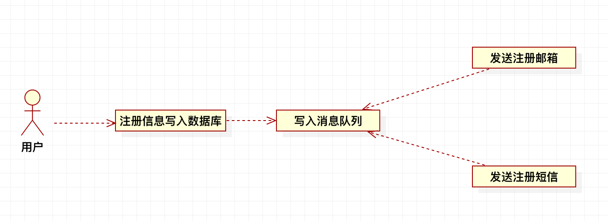
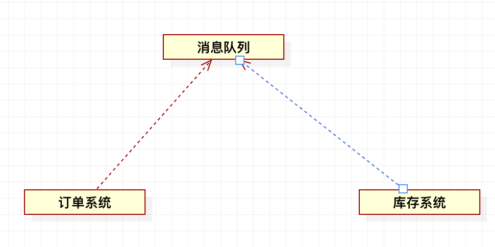
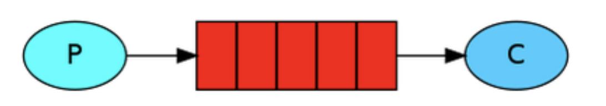
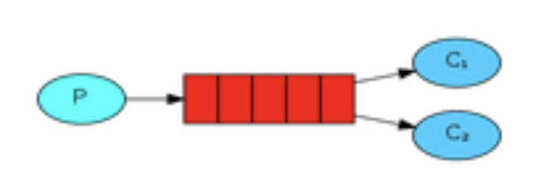
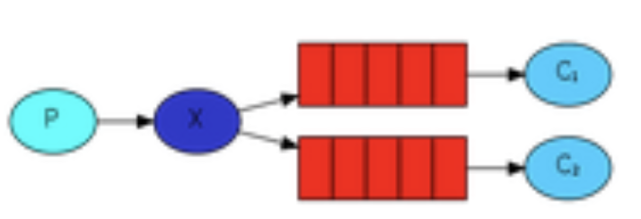
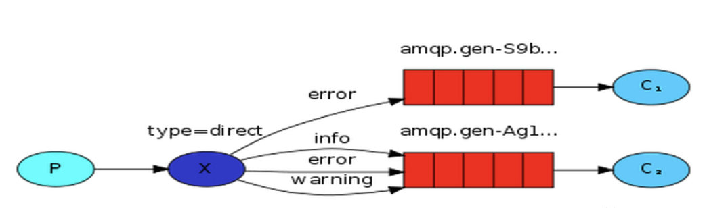
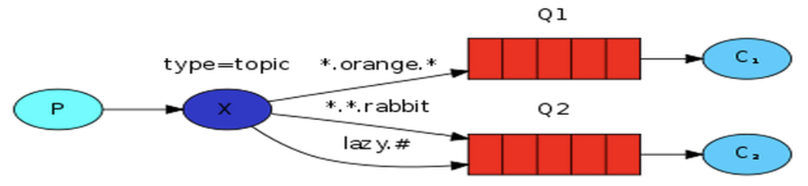

#Python消息队列

#### 什么是MQ

- 消息队列（Message Queue，简称MQ）
- 主要用途：不同进程Process/线程Thread之间通信

####MQ概述

- 消息队列中间件是分布式系统中重要的组件，主要解决额应用解耦，异步消息，流量削锋等问题，实现高性能，高可用，可伸缩和最终一致性框架。

#### MQ应用场景

- 异步处理：

  - 场景：用户注册后，需要发注册邮箱和注册短信

  - 传统方式为：串行方式和并行方式

  - 采用消息队列后：

    

不同于串行方式和并行方式，使用消息队列，注册邮箱，发送短信写入消息队列后直接返回，就可以极大的缩短用户的响应时间

- 应用解耦

  - 场景：用户下单后，订单系统需要通知库存系统
  - 传统方式为：订单系统调用库存系统的接口（库存系统无法访问，则 订单减库存降失败，从而导致订单失败）
  - 采用消息队列后：

  

#### 使用RabbitMQ

- RabbitMQ是一个开源的，在AMQP基础上完整的，可复用的企业消息系统。
- 支持主流的操作系统
- 支持多种开发语言

##### 5种队列

- 简单队列 
  - 简单队列的生产者和消费者关系一对一
  - P：消息的生产者；C：消息的消费者；中间为队列
  - 

- Work模式
  - 一个生产者、两个消费者
  - MQ中一个消息只能被一个消费者获取。该模式适用于集群。能者多劳，性能好的可恶意安排多消费，性能低的可以安排低消费。
  - 

- 订阅模式
  - 一个生产者、多个消费者
  - 每个消费者都有自己的队列
  - 生产者将消息发送到交换机，俄而不是直接发送到队列
  - 每个队列都要绑定到交换机
  - 这种模式可以满足生产者发布一个消息，多个消费者消费同一消息的需求
  - 

- 路由模式
  - 路由模式可以在生产者生产消息的时候，加入Key值，与Key值匹配的消费者消费消息
  - 该模式可以满足不同的消费者消费的消息有部分的差异
  - 

- 通配符模式
  - 该模式是路由模式的升级
  - 允许Key模糊匹配
  - *代表一个词，#代表一个或多个词 
  - 

##### RabbitMQ的安装

- 安装系统为macOS

  ```
  brew install rabbitmq
  ```

  ```
  cd. /usr/local/Cellar/rabbitmq/3.8.0
  ```

  启动rabbitmq：

  ```
  sudo sbin/rabbitmq-server
  ```

  启动插件：

  ```
  sudo sbin/rabbitmq-plugins enable rabbitmq_management
  ```

  登陆管理界面：localhost:15672

  初始的用户名和密码都为guest

- 配置环境变量

  ```
  sudo vi /etc/profile 
  //加入以下两行 
  export RABBIT_HOME=/usr/local/Cellar/rabbitmq/3.7.4 export PATH=$PATH:$RABBIT_HOME/sbin 
  //立即生效 
  source /etc/profile
  ```

- 后台启动rabbitMQ

  ```
  sudo rabbitmq-server -detached
  ```

- 查看状态

  ```
  sudo rabbitmqctl status
  ```

- 关闭

  ```
  rabbitmqctl stop
  ```

- 其他

  ```
  sudo rabbitmqctl start_app
  
  sudo rabbitmq-plugins list
  ```

#### Python 中使用RabbitMQ

python通过pika负责与消息队列的连接。

###### 发送消息代码

- 连接到rabbitmq服务器

```python
connection = pika.BlockingConnection(pika.ConnectionParameters('localhost'))
channel = connection.channel()
```

- 声明消息队列，消息将在这个队列中进行传递。如果将消息发送到不存在的队列，rabbitmq将会自动清除这些消息

```python
channel.queue_declare(queue='hello')
```

- 发送消息到上面声明的hello队列，其中exchange表示交换器，能精确指定消息应该发送到哪个队列，routing_key设置为队列的名称，body就是发送的内容。

```python
channel.basic_publish(exchange='', routing_key='hello', body='Hello World')
```

- 关闭连接

```python
connection.close()
```

- 执行上述代码，则rabbitmqctl成功增加了hello队列，队列中多出一条信息，查看命令：

```
sudo rabbitmqctl list_queues
```

- 删除全部消息队列

```
rabbitmqctl stop_app
rabbitmqctl reset
rabbitmqctl start_app
```

###### 接收消息代码

- 核心代码 

```
channel.basic_consume('hello', callback, False)
channel.start_consuming()
```

